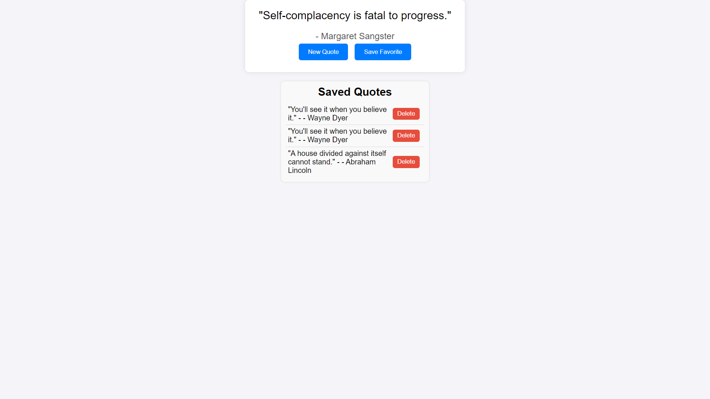

# Dynamic Quote Generator

A simple web application that fetches and displays random quotes, allows users to save their favorite quotes, and delete them when needed. Built using HTML, CSS, and JavaScript.

## Features

- Fetch random quotes from an external API.
- Display the fetched quote and author.
- Save favorite quotes to the browser's local storage.
- Display saved quotes on the page.
- Delete quotes from the saved list.

## Live Demo

You can view the live demo of this project on Vercel: [Dynamic Quote Generator](https://dynamic-quote-generator.vercel.app)

## Getting Started

Follow these instructions to get a copy of the project up and running on your local machine for development and testing purposes.

### Prerequisites

You need a modern web browser and a text editor to view and edit the code.

### Installation

1. Clone the repository:

   ```bash
   git clone https://github.com/falitroke/dynamic-quote-generator.git

2. Navigate to the project directory:
   cd dynamic-quote-generator

3. Open index.html in your web browser to view the application.

## Usage

Click on "New Quote" to fetch and display a random quote.
Click on "Save Favorite" to save the displayed quote to the list of saved quotes.
View saved quotes in the "Saved Quotes" section below the main quote display.
Click the "Delete" button next to a saved quote to remove it from the list.

## Built With

HTML
CSS
JavaScript

## API

Quotes are fetched from the type.fit Quotes API.

## Project Structure

dynamic-quote-generator/
│
├── index.html
├── style.css
├── script.js
└── README.md

## Contributing

Contributions are welcome! Please feel free to submit a pull request or open an issue.

## License

This project is licensed under the MIT License - see the LICENSE file for details.

## Acknowledgments
   
   - Quotes provided by type.fit.
   - Inspired by various online tutorials and projects.

## Screenshots

